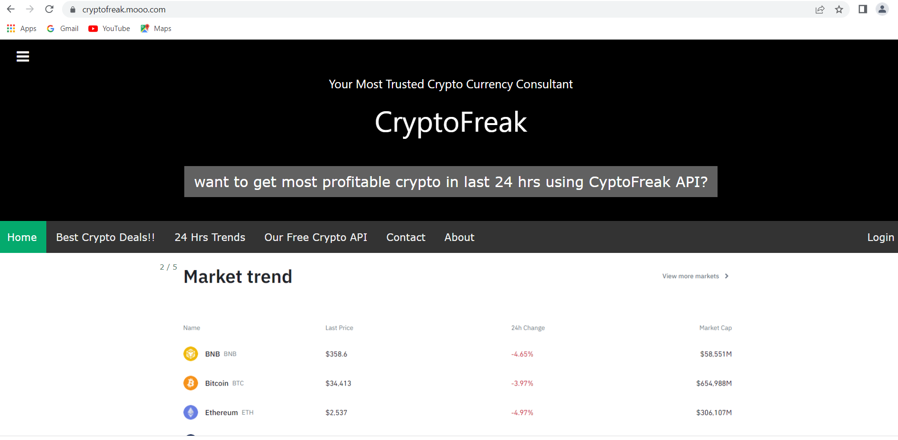

# Project Name: CryptoFreak
## Your Most Trusted Crypto Currency Consultant and API service provider.
> An AI based Crypto Consultancy services web app with Free inbuilt API

> Live demo [_here_](https://cryptofreak.mooo.com/). <!-- If you have the project hosted somewhere, include the link here. -->

## Table of Contents
* [General Info](#general-information)
* [Technologies Used](#technologies-used)
* [Features](#features)
* [Screenshots](#screenshots)
* [Setup](#setup)
* [Usage](#usage)
* [Project Status](#project-status)
* [Room for Improvement](#room-for-improvement)
* [Acknowledgements](#acknowledgements)
* [Contact](#contact)
<!-- * [License](#license) -->

## General Information
- a webserver and API service provider to analyze 24 hours market trends of the virtual currency (Crypto) based on price change (%) and give suggestions to the clients about the best coin deals to invest/ sell based on its stability.
- We are trying to make an all in all web app solution that could provide crypto business consultancy in both visual representation and process the API requests.
- To provide visulal anaysis and prediction for best crypto deals in real time with a purpose serve as data provider for other 3rd party starups.
- Cryptocurrency is very popular nowadays because of its tremendaous characteristics– faster transactions, lower transaction costs, higher security, proper privacy, inflation protection, transparency, etc. Also, it is an easier way for money transactions in this digital era. So, any fluctuation on the market trends can impose a huge impact for crypto buyer and seller. As a result, a user needs a realtime, faster, and accurate consultancy service to get a overall better deal.
<!-- You don't have to answer all the questions - just the ones relevant to your project. -->

## Core Technologies Used
- NGINX web server & reverse proxy, DNS, Uvicorn, Gunicorn
- Oracle cloud service (Canonical Ubuntu 20.04, ampere 4 core, 24 GB)
- FastAPI
- Jupyter Lab, miniconda, python, git, database
- Linux and Cloud firewall, HTTPS (letsencrypt (certbot))
- Python, HTML, CSS, JS, Ajax, sqlite3, jQuery.

## Features
List the ready features here:
- A cloud base web server
- API service provider
- Machine Learning based smart analysis tool for best deals and market trends notifier.
- data downloading option with .xlsx and .json from both web server and API.

## Screenshots

<!-- If you have screenshots you'd like to share, include them here. -->

## Setup
A requirements.txt helps to proceed to describe how to install / setup one's local environment / get started with the project.

## Usage
To start your Uvicorn, Nginx, FastAPI servers
After installing, just run the uvicorn reload command.
Command for installing systems:

`conda install -c conda-forge uvicorn nginx fastapi`

To run the server:

`uvicorn main:app --reload`

## Project Status
Project is: _complete_

## Room for Improvement

Room for improvement:
- Market trends are quite time series data, so it might need RNN based deep learning models.
- UI/US can be improved.

To do:
- User subscription based model and payment gateway
- Real time time series prediction using LSTM/ Bi-LSTM architecture.

## Acknowledgements

- This project was inspired by...(https://www.binance.com/)
- This project was based on [this tutorial](https://www.w3schools.com/w3css/tryw3css_templates_teal.htm   https://www.w3schools.com/w3css/tryit.asp?filename=tryw3css_templates_black&stacked=h).
- Many thanks to... Dr. Kyle Johnesen, Associate Professor, UGA and Mr. Brook.

## Contact
Created by [@asad](https://bd.linkedin.com/in/asad14053) - feel free to contact me!

# Thank You!
<!-- Optional -->
<!-- ## License -->
<!-- This project is open source and available under the [... License](). -->

<!-- You don't have to include all sections - just the one's relevant to your project -->
