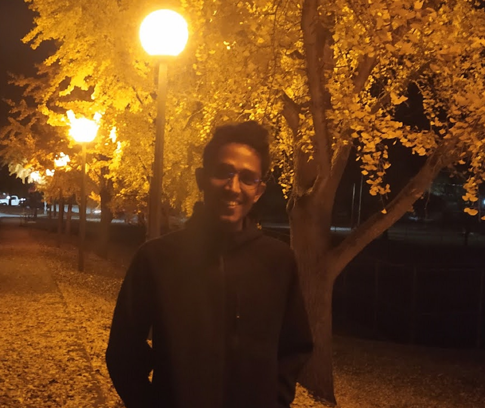

Your Given Name: Md. Asaduzzaman Jabin

Your Preferred Name: Asad

Your Preferred Pronoun: He/His

Your Major: Ph.D. student, Electrical and Computer Engineering

Other Degrees (e.g. Bachelors): B.Sc. in Information and Communication Technology 

List 3 things you hope to get out of the class:
1. Data pre-processing for ML problems
2. Upload a data set to Cloud server for realtime ML processing
3. Get Data using DB quesries from cloud base ML solutions. 

Tell me a little about yourself (e.g. hobbies, career aspirations):

Asad is currently pursuing his Ph.D. in Electrical and Computer Engineering at The University of Georgia, Athens, GA-30602, USA. His strengths lie in computer programming (C/C++, Java, Python, MySQL, JS .etc), robotics, and machine learning. He is a former senior software engineer of Samsung Research. His most recent dream is to become a CEO of any IT companies or, set up own startup for IT solutions.

His current research interest is to develop fiber optic sensing systems for soft robots using machine learning and the development of biomedical sensors, photonic implementation of neuromorphic algorithms, and developing new photonic techniques for dynamic and flexible RF communication systems.
Photo

